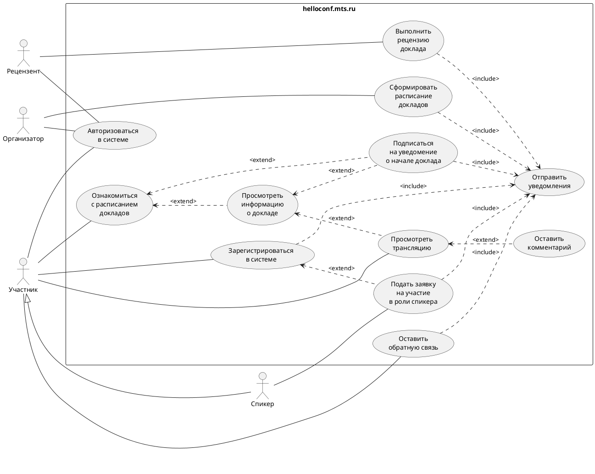

# Описание требований и архитектуры

## Введение
<!-- Общее краткое описание создаваемой системы -->
В рамках курса осуществляется проектирование решения на основании [описания бизнес-кейса](#бизнес-кейс), представленного заказчиком.

- [Описание требований и архитектуры](#описание-требований-и-архитектуры)
  - [Введение](#введение)
  - [Бизнес-кейс](#бизнес-кейс)
  - [Заинтересованные стороны](#заинтересованные-стороны)
  - [Бизнес-контекст (бизнес-требования)](#бизнес-контекст-бизнес-требования)
    - [Предпосылки](#предпосылки)
    - [Цели и задачи](#цели-и-задачи)
  - [Глоссарий](#глоссарий)
  - [Модель предметной области](#модель-предметной-области)
  - [Требования к системе](#требования-к-системе)
    - [Сценарии использования (Use case)](#сценарии-использования-use-case)
    - [Функциональные требования](#функциональные-требования)
    - [Нефункциональные требования/Требования к атрибутам качества](#нефункциональные-требованиятребования-к-атрибутам-качества)
    - [Ограничения](#ограничения)
  - [Архитектура](#архитектура)
    - [Журнал архитектурных решений](#журнал-архитектурных-решений)
    - [Контекст решения](#контекст-решения)
    - [Компонентная архитектура](#компонентная-архитектура)
    - [Реализация сценариев использования](#реализация-сценариев-использования)
    - [Программные интерфейсы](#программные-интерфейсы)
    - [Схема развертывания](#схема-развертывания)
  
---

## Бизнес-кейс
<!-- Описание бизнес-кейса -->
Вы решили запустить конференцию helloconf.mts.ru и столкнулись с огромным количеством желающих подать доклад. Работа с докладчиками не такая уж и простая – нужно отрецензировать доклады, дать обратную связь, скомпоновать в программу конференции.

Приложение должно содержать как минимум следующие функциональные блоки:
- Работа с докладчиками
- Работа с расписаниями
- Проведение конференции (трансляция, сбор обратной связи)
  
---

## Заинтересованные стороны
<!-- Перечень заинтересованных сторон и их интересов по отношению к создаваемой системе. 
Подробнее: https://confluence.mts.ru/pages/viewpage.action?pageId=399975538 
-->
| Заинтересованная сторона | Интересы           |
|:-------------------------|:-------------------|
| Организатор конференции | Грамотно организованное расписание докладов участников, оперативное решение обращений от пользователей площадки на первой линии поддержки, возможность предоставления обратной связи о прошедшем мероприятии |
| Рецензенты (программный комитет) | Представление на конференции только актуальных по тематике, а также качественно выполненных докладов |
| Команда разработки | Разработка наиболее эффективной реализации платформы, учёт требований всех стейкхолдеров |
| Спикер | Простой и понятный процесс регистрации в качестве спикера, работа с обратной связью (комментариями) по докладу, своевременное информирование о дате и времени выступления, безаварийная трансляция выступления с докладом, возможность предоставления обратной связи о прошедшем мероприятии |
| Слушатель | Простой и понятный процесс регистрации в качестве слушателя, ознакомление с расписанием выступлений, своевременное информарование о выступлениях, безаварийная трансляция выступления, возможность предоставления обратной связи о прошедшем мероприятии |
| Техническая поддержка | Оперативное решение поступающих обращений пользователей платформы |
| Топ-менеджеры компании | Популяризация конференции, поднятие репутации площадки проведения конференций и, как следствие - репутации компании-организатора |
| Департамент информационной безопасности | Соблюдение требований информационной безопасности, правильно выстроенный процесс работы с персональными данными |
| Облачная платформа | Безаварийная работа серверов, выделенных для разрабатываемой площадки конференции |

---

## Бизнес-контекст (бизнес-требования)
<!-- Общее описание бизнес-контекста создаваемой системы (автоматизируемой деятельности), список бизнес-целей заинтересованных сторон 
Подробнее: https://confluence.mts.ru/pages/viewpage.action?pageId=399973845
-->
### Предпосылки

Площадка для проведения ИТ-конференций позволяет техническим специалистам взаимодействовать, обмениваться опытом и повышать свою квалификацию в одном месте. Учитывая скорость развития ИТ-технологий, появления новых идей, создание такой площадки стало необходимостью.
Общение технических специалистов различных профилей, возможность задавать вопросы и обмениваться мнениями позволяет получать ценный опыт, который может быть использован в работе. Площадка проведения ИТ-конференций стимулирует развитие и обмен компетенциями в сфере ИТ, что в свою очередь повышает квалификацию специалистов и обеспечивает успех в бизнесе, а возможность просмотра записей докладов позволяет заинтересованным слушателям знакомится с материалами без необходимости физически присутствовать в зале, что делает процесс обучения более доступным и гибким.

### Цели и задачи

Целью создания площадки проведения ИТ-конференций заключается в повышении квалификации технических специалистов и повышение репутации компании-организатора через обмен компетенциями и опытом.  

Задачи создания площадки включают в себя:
- разработку и запуск платформы для проведения ИТ-конференций, которая обеспечивает участникам возможность взаимодействия и обмена опытом
- привлечение ведущих экспертов и технических специалистов, которые будут выступать на конференциях и обеспечивать высокий уровень обучения и обмена мнениями,
- обеспечение возможности записи конференций и доступа к ним в будущем, чтобы участники могли использовать полученные знания и опыт в своей работе
- разработка механизмов обратной связи и оценки качества проведения конференций, чтобы обеспечить их постоянное улучшение и соответствие потребностям участников.

Формализуя и детализируя поставленные цели и задачи можно сформировать следующий список бизнес-требований:

| ID     | Бизнес-требование                      |
|:------:|:---------------------------------------|
| BR.001 | Необходимо создать инструмент, позволяющий собирать вместе специалистов из разных организаций (а в идеале - из разных стран) для возможности перенятия и использования в повседневной деятельности лучших практик как федерального, так и мирового уровня |
| BR.002 | Создание указанного инструмента должно позволить стимулировать повышение квалификации сотрудников компании путем организации общения технических специалистов между собой по различным тематикам |
| BR.003 | Участие в роли докладчика должно иметь низкий порог входа для возможности выявления молодых талантливых специалистов как внутри организации, так и за пределами ее |
| BR.004 | Необходимо отслеживать актуальность тематики и содержания докладов выступающих для поддержания высокого уровня конференций, что должно способствовать повышению репутационного профиля организации |
| BR.005 | Организация и проведение конференций должны иметь итеративную модель улучшения на основании обратной связи от участников для повышения их количества в будущем |
| BR.006 | Все выступления, совершенные в рамках проводимых конференций должны быть доступны в виде записей для возможностей последущего вдумчивого анализа представленных материалов |

---

## Глоссарий
<!-- Содержит основные понятия и термины предметной области  
Подробнее: https://confluence.mts.ru/pages/viewpage.action?pageId=375782595
-->
| Понятие                        | Сокращение                         | Определение                       |
|:-------------------------------|:-----------------------------------|:----------------------------------|
| Организатор || Член организационного комитета, который отвечает за организацию и проведение конференции в целом |
| Рецензент || Член программного комитета, который отвечает за наполнение конференции, актуальность и тематический состав докладом |
| Пользователь || Посетитель сайта конференции, не прошедший регистрацию и аутентификацию |
| Участник || Человек, который посещает конференцию для того, чтобы послушать доклады и пообщаться с другими специсалистами |
| Спикер || Участник, который планирует выступление на конференции с докладом |
| Видеохостинг || Внешняя система, которая осуществляет стриминг конференции, а также предоставляет доступ к записям докладом |

---

## [Модель предметной области](data/data.md)

---

## Требования к системе

### Сценарии использования (Use case)
<!-- Подробное описание сценариев использования системы с привязкой к ролям участников и задействованным бизнес-сущностям 
https://confluence.mts.ru/pages/viewpage.action?pageId=375782108 
https://confluence.mts.ru/pages/viewpage.action?pageId=375782119 
-->
#### Диаграмма сценариев использования (Use Case Diagram) <!-- omit in toc -->

#### Список сценариев использования <!-- omit in toc -->

| ID     | Описание                                          |
|:------:|---------------------------------------------------|
| UC.001 | [Зарегистрироваться в системе](uc/uc.001.md) |
| UC.002 | [Авторизоваться в системе](uc/uc.002.md) |
| UC.003 | [Подать заявку на участие в роли спикера](uc/uc.003.md) |
| UC.004 | [Выполнить рецензию доклада](uc/uc.004.md) |
| UC.005 | [Сформировать расписание докладов](uc/uc.005.md) |
| UC.006 | [Ознакомиться с расписанием докладов](uc/uc.006.md) |
| UC.007 | [Просмотреть информацию о докладе](uc/uc.007.md) |
| UC.008 | [Подписаться на уведомение о начале доклада](uc/uc.008.md) |
| UC.009 | [Отправить уведомления](uc/uc.009.md) |
| UC.010 | [Просмотреть трансляцию](uc/uc.010.md) |
| UC.011 | [Оставить обратную связь](uc/uc.011.md) |
| UC.012 | [Оставить комментарий](uc/uc.012.md) |

### Функциональные требования
<!-- Описание требований к функциям, реализуемым системой. Требование может быть привязано к сценарию использования или быть общим 
Подробнее: https://confluence.mts.ru/pages/viewpage.action?pageId=375782501 
-->
| ID     | Функциональное требование | Функциональный блок | Сценарии |
|:------:|:--------------------------|:-------------------:|:--------:|
|| Система должна: |||
| FR.001 | Проверять корректность данных, вводимых пользователем | Профиль участника | [UC.001](uc/uc.001.md), [UC.002](uc/uc.002.md) |
| FR.002 | При регистрации проверять, не зарегистрирован ли уже введенный e-mail | Профиль участника | [UC.001](uc/uc.001.md) |
| FR.003 | Проверять корректность внесения изменений в расписание| Работа с расписанием | [UC.005](uc/uc.005.md) |
|| Система должна позволять: |||
| FR.004 | Участникам зарегистрироваться в системе в качестве слушателя или спикера | Профиль участника | [UC.001](uc/uc.001.md) |
| FR.005 | В процессе регистрации подать заявку на участие в роли спикера | Профиль участника | [UC.003](uc/uc.003.md) |
| FR.006 | Участникам проходить авторизацию | Профиль участника | [UC.002](uc/uc.002.md) |
| FR.007 | Спикерам загружать материалы доклада для рецензирования | Работа со спикерами | [UC.003](uc/uc.003.md) |
| FR.008 | Рецензентам (членам программного комитета) рецензировать доклады спикеров | Работа со спикерами | [UC.004](uc/uc.004.md) |
| FR.009 | Организатору управлять расписанием докладов спикеров | Работа с расписанием | [UC.005](uc/uc.005.md) |
| FR.010 | Участникам просматривать расписание докладов | Работа с расписанием | [UC.006](uc/uc.006.md) |
| FR.011 | Участникам просматривать информацию о докладах | Работа с расписанием | [UC.007](uc/uc.007.md) |
| FR.012 | Участникам подписаться на уведомления о начале доклада | Работа с расписанием | [UC.008](uc/uc.008.md) |
| FR.013 | Участникам смотреть интересующие их трансляции в режиме онлайн | Проведение конференции | [UC.010](uc/uc.010.md) |
| FR.014 | Участникам смотреть записи интересующих их трансляций | Проведение конференции | [UC.010](uc/uc.010.md) |
| FR.015 | Участникам оставлять комментарии к онлайн трансляциям докладов | Проведение конференции | [UC.012](uc/uc.012.md) |
| FR.016 | Участникам оставлять обратную связь о конференции | Проведение конференции | [UC.011](uc/uc.011.md) |
|| Система должна рассылать уведомления: |||
| FR.017 | Участникам об успешной регистрации в качестве слушателя или спикера | Рассылка уведомлений | [UC.009](uc/uc.009.md) |
| FR.018 | Рецензентам (членам программного комитета) о поступившем на рассмотрение докладе | Рассылка уведомлений | [UC.009](uc/uc.009.md) |
| FR.019 | Спикерам о статусе рецензирования доклада | Рассылка уведомлений | [UC.009](uc/uc.009.md) |
| FR.020 | Участникам об изменении расписания выступлений | Рассылка уведомлений | [UC.009](uc/uc.009.md) |
| FR.021 | Участникам о начале трансляции выбранных ранее выступлениях | Рассылка уведомлений | [UC.009](uc/uc.009.md) |
| FR.022 | Организатору об оставленной обратной связи | Рассылка уведомлений | [UC.009](uc/uc.009.md) |

### Нефункциональные требования/Требования к атрибутам качества
<!-- Требования к основным архитектурным характеристикам (атрибутам качества) системы - надежность, масштабируемость, ИБ, и др.
Подробнее: https://confluence.mts.ru/pages/viewpage.action?pageId=375782530
-->
| ID     | Бизнес-метрика | Описание требования | Показатель качества |
|:------:|----------------|---------------------|---------------------|
| QR.001 | Количество зарегистрированных пользователей на платформе | Максимальное количество пользователей, зарегистрированных на платформе - 20000 | Измеряется общее количество зарегистрированных пользователей |
| QR.002 | Доступность платформы концеренции | Платформа должна быть доступна 99% времени | Оцениваются фактические среднемесячные показатели доступности всех функций, описанных в требованиях |
| QR.003 | Скорость работы платформы | Производительность платформы при большом количестве посетителей - 3000 запросов в секунду | При работе платформы в течение часа с указанной интенсивностью запросов, время отклика не должно превышать 0,5 с для 95% запросов |
| QR.004 | Скорость работы платформы | Время загрузки страниц конференции - не более 3 секунд | Измеряется время с момента отправки запроса до полной загрузки страницы при одновременном использовании 2000 человек для 90% запросов|
| QR.005 | Активность обсуждения участниками онлайн трансляции | Максимальное количество комментариев к трансляции 5 в секунду| Измеряется количество комментариев к одной трансляции при одновременном нахождении в конференции 3000 человек для 95% комментариев|
| QR.006 | Количество параллельных выступлений | Максимальное количество параллельных онлайн трансляций - 3 | Количество параллельных трансляций измеряется в рамках одной конференции при параллельной активности двух разных конференций |
| QR.007 | Удовлетворенность пользователей работой платформы | Среднее время решения технических проблем - не более 1 часа | Измеряется с момента фиксации ошибки до момента ее устранения для 99% заявок |
| QR.008 | Удовлетворенность пользователей работой платформы | Время восстановления должно быть не более 5 минут | Измеряется с момента возникновения сбоя в сети до возобновления доступа к данным в условиях максимальной нагрузки 3000 запросов в секунду для 98% случаев |

### Ограничения
<!-- Описываются ограничения, оказывающие влияние на архитектуру системы - временные, финансовые, технологические
Подробнее: https://confluence.mts.ru/pages/viewpage.action?pageId=375782592
-->
| ID     | Ограничение            |
|--------|------------------------|
| AC.001 | *Описание ограничения* |

---

## Архитектура

### Журнал архитектурных решений
<!-- Записи о ключевых принятых архитектурных решениях (ADR) для реализации архитектурно-значимых требований.
Подробнее: https://confluence.mts.ru/pages/viewpage.action?pageId=421162308
-->
- [ADR.NNN Суть решения](adr/adr-template.md)

### [Контекст решения](context/context.md)

### [Компонентная архитектура](components/components.md)

### Реализация сценариев использования
<!-- Реализация сценариев использования на основе взаимодействия компонентов системы и внешних систем/участников.
Диаграммы последовательности (UML Sequence diagram) и текстовое описание.

Подробнее: 
https://confluence.mts.ru/pages/viewpage.action?pageId=399442132
https://confluence.mts.ru/pages/viewpage.action?pageId=399442170
-->
| ID     | Описание                          | Реализация                                    |
|--------|-----------------------------------|-----------------------------------------------|
| UC.001 | *Название сценария использования* | [Реализация сценария](uc-impl/uc.001-impl.md) |

### Программные интерфейсы
<!-- Спецификации публичных API системы и ее компонентов (синхронных, событийных). Создается на основе модели предметной области для реализации сценариев использования. 
  Форматы: OAS/Swagger, GraphQL, AsyncAPI/CloudEvents
-->
| Компонент             | Интерфейс                                      |
|:----------------------|:-----------------------------------------------|
| *Название компонента* | *[Название интерфейса](api/service-name.yaml)* |

### [Схема развертывания](deployment/deployment.md)
